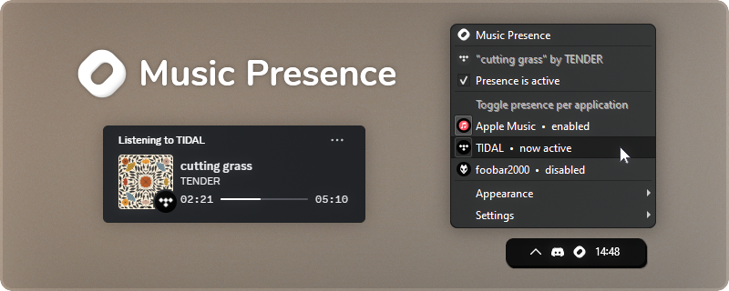

&nbsp;
&nbsp;
&nbsp;

&nbsp;

&nbsp;

**Music Presence** shows your friends on Discord
what music you are listening to.

It works with any media player, be that e.g. Spotify, TIDAL or foobar2000.
When you play music with an app, it is automatically detected
and appears in the tray menu, as you can see in the screenshot above!

These are some of the most notable features

- Shows the **correct album cover 100% of the time** for every media player,
  no missing covers
- Shows the exact current playback position, if the media player supports it
- Fine-grained control over which applications are shared and which are not
- The tray icon changes and reflects
  whether your status is currently active or not

---

<!-- DL_BUTTONS_BEGIN -->

<!-- DL_BUTTONS_END -->

> For detailed installation instructions read this document:
> [**How to install and use Music Presence**](./documentation/installation-instructions.md)

You can also install Music Presence using a package manager:

- On macOS via Homebrew: `$ brew install music-presence`
- On Arch via the AUR: `$ yay -S music-presence-bin` (unofficial, verify before installing)

Join our Discord: [**discord.gg/musicpresence**](https://discord.gg/musicpresence)

---

[**Download**](https://github.com/ungive/discord-music-presence/releases/latest)
&nbsp;&bullet;&nbsp;
[**Discord**](https://discord.com/invite/7rc8dWD4ug)
&nbsp;&bullet;&nbsp;
[**Donate**](https://bio.site/musicpresence)
&nbsp;&bullet;&nbsp;
[**Documentation**](./documentation/README.md)
&nbsp;&bullet;&nbsp;
[**Changelog**](./CHANGELOG.md)
&nbsp;&bullet;&nbsp;
[**Roadmap**](./documentation/roadmap.md)
&nbsp;&bullet;&nbsp;
[**Privacy**](./PRIVACY.md)

---

## Features

- Music Presence works with *any* media player!  
  Currently **75+** different players are supported. You can find an always up-to-date list [here](https://musicpresence.pocha.moe/) (this page was made by a community member). Adding a missing one is [trivial](./documentation/troubleshooting.md#if-your-media-player-is-still-not-detected)!

- Shows the correct album cover image **100%** of the time!  
  *This works with any media player and is achieved without the use of external image sources.*

- You have the option to show the artist name, song title, player name or the media type after the "Listening to" text. Examples are: "Listening to Billie Eilish", "Listening to Happier Than Ever", "Listening to Spotify" or "Listening to Music".

- Shows animated album artwork directly in your status for supported players. This currently works with Apple Music and TIDAL. Album cover videos are converted on the fly and may take a few seconds to load.

- You can also show paused media in your status for as long as you want! Love that one song so much, you wanna show it forever? Just play it once, pause it and basically sticky pin it to your profile card.

- Fine-grained control over which applications are shared in your status and what your status looks like, including individual settings and the option to override settings for each media player individually.

- Perfect synergy with Spotify and the official Spotify integration! Podcasts can be shown in your status with the title "Listening to a Podcast", while the official Spotify integration doesn't show podcasts. You can also just use Music Presence for Spotify podcasts and use the official Spotify integration for music.

- The tray icon changes and reflects the current state of Music Presence, i.e. whether it is currently sharing media in your status, whether it's waiting for media playback or if it has been disabled by you entirely.

- Always shows the exact playback position with a progress bar, if the media player supports it.

- Obsoletes the need for other Rich Presence applications or plugins for your music player, by giving you unified controls and customization for all media players in a single place.

- In-app and automatic updates of Music Presence, so you don't have to install new versions by downloading them manually. In addition to that you're always informed about any changes and additions with an informational popup.

- Shows a "Play on Apple Music" button or similar for supported players. This is currently available for Apple Music, TIDAL, Deezer and Spotify only. The button may not always show due to API rate limiting. Additionally to buttons, you also get the option to load and show additional artists, not just the main one.

- *And much, much more...*

Looking for scrobbling, browser support and listening along?  
Check out [**musicpresence.app**](https://musicpresence.app?utm_source=github.com&utm_medium=project-readme), specifically the "Timeline" section. I have big plans for the future!

## Further links

- [Supported media players](./documentation/supported-media-players.md)
- [What if my media player is not detected?](./documentation/troubleshooting.md)
- [Integrating with Music Presence for third-parties](./documentation/third-party-integration.md)
- [Verifying your download](./documentation/automatic-updates.md#verifying-releases)

## Donations

The development of this project solely depends
on the effort of a single developer.
Your financial support allows me to invest more of my time into this project
and helps cover recurring server and domain costs,
which ultimately helps in making improvements
and working on [new features](./documentation/roadmap.md)
that are waiting to be implemented!

Any donation is highly appreciated. Thank you!

* **[Patreon](https://www.patreon.com/musicpresence)**
  &nbsp;&ndash;&nbsp; membership with additional perks
* **[Buy me a coffee](https://buymeacoffee.com/jonasvandenberg)**
  &nbsp;&ndash;&nbsp; option for one-time donations
* **[GitHub Sponsors](https://github.com/sponsors/ungive)**
  &nbsp;&ndash;&nbsp; donate directly here on GitHub and get a sponsor badge
* **[LiberaPay](https://liberapay.com/jonasvandenberg)**
  &nbsp;&ndash;&nbsp; option for recurring donations
  to build a steady side income

You can read [**here**](./FUNDING.md) for more information.

## Community

Our community is slowly growing
over on our [**Discord**](https://discord.com/invite/7rc8dWD4ug) server!

If you ever encounter an issue, have a question
or simply want to chat with me and other users of Music Presence,
you are more than welcome to swing by.
I'm usually very active there and respond to messages rather quickly.

## Star History

## Media

Links to other places on the internet that mention Music Presence

- 24.07.2025&nbsp; **r/lastfm**&nbsp; [A universal last.fm scrobbler is coming – for any media player on any desktop device ](https://www.reddit.com/r/lastfm/comments/1m8fped)
- 07.07.2025&nbsp; **Peerlist**&nbsp; [Music Presence ranked #2 on <ins>Peerlist's Launchpad</ins> with the most upvotes](https://peerlist.io/ungive/project/music-presence)
- 27.06.2025&nbsp; **r/discordapp**&nbsp; [Share any music player as a Discord activity with my tool Music Presence](https://www.reddit.com/r/discordapp/comments/1lloumc)
- 17.12.2024&nbsp; **Wotaku Wiki**&nbsp; [Featured on <ins>wotaku.wiki</ins> under Music](https://wotaku.wiki/music#misc)
- 14.11.2024&nbsp; **freemediaheckyeah**&nbsp; [Featured on <ins>fmhy.net</ins> under Client Customization](https://fmhy.net/social-media-tools#client-customization)
- 06.11.2024&nbsp; **r/AppleMusic**&nbsp; [The Discord integration you've been waiting for – Music Presence](https://www.reddit.com/r/AppleMusic/comments/1gkzkwu)
- 01.11.2024&nbsp; **r/foobar2000**&nbsp; [Discord status problems? Try Music Presence and never look back](https://www.reddit.com/r/foobar2000/comments/1gh8bhb)
- 24.09.2024&nbsp; **GitHub**&nbsp; [Featured in <ins>NoPlagiarism/awesome-discord-activities</ins>](https://github.com/NoPlagiarism/awesome-discord-activities)
- 21.09.2024&nbsp; **GitHub**&nbsp; [Featured in <ins>MoonWalker440/Music-Megathread</ins>](https://github.com/MoonWalker440/Music-Megathread)
- 21.09.2024&nbsp; **MusicBee Forum**&nbsp;
  [A new Discord Rich Presence for MusicBee](https://getmusicbee.com/forum/index.php?topic=41833.0)

<!--
- 02.06.2024&nbsp; **r/TIdaL**&nbsp;
  [I made a Discord status for TIDAL – Music Presence](https://www.reddit.com/r/TIdaL/comments/1d6azbm)
- 20.09.2024&nbsp; **r/musicbee**&nbsp;
  [Reliable album covers in your Discord status with Music Presence](https://www.reddit.com/r/musicbee/comments/1fli01d)
-->

## Improving media players

Some media players report incomplete song metadata.
The following is a list of bug reports that were submitted
in order to improve what metadata these players report,
so that they can work better with Music Presence in the future.

- 25.06.2024&nbsp; [**MediaSession API does not report the album to the Windows system**](https://issues.chromium.org/issues/349310439)  
  Many media players are built on-top of **Chromium**,
  especially media players of popular streaming services,
  which unfortunately does not report the current album name.
  This affects players like TIDAL amongst quite a few others.
  Initially reported this to TIDAL [here](https://github.com/orgs/tidal-music/discussions/74).

## Disclaimer

- This software is **not** affiliated with or endorsed by Discord.  
- This software is **not** affiliated with or endorsed by
  any streaming service, media player or company that distributes music,
  including but not limited to those displayed within the Music Presence app.

---

Copyright (c) 2024-2025 Jonas van den Berg
