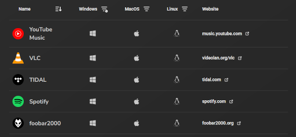

# Contributors

I want to take a moment to thank everyone who has put the time in
to contribute to Music Presence's development,
be that in the form of translations, adding features to the Discord bot,
making a donation, helping users who join the server with their issue,
taking the time to write up tons of useful macros for the bot,
testing beta versions of the app extensively, to make sure it's bug-free,
or moderating the Discord server and helping new users.

Without you the app would be lacking a soul
and I would feel much less proud of our community.

Last updated: 12.07.2025

## Sponsors

Thank you to everyone who funds my work financially.
I know how much trust you put in me by supporting me in this way
and I can't thank you enough.
I can't possibly keep this list updated by hand,
but I will mention the people whose GitHub name I know
and who have been around the longest
or made substantial donations:

- [@NocFA](https://github.com/NocFA) -
  Sometimes I think you're more passionate about Music Presence than me!
  Thank you for being around for so long.
- [@PragaJake88](https://github.com/PragaJake88) -
  Thank you for being my first "Superfan" (Patreon tier),
  for making a substantial contribution for the Apple Developer account
  and for boosting the server so much
  that we hade enough boosts when server tags came around!
- [@marcj](https://github.com/marcj) -
  Thank you for making a substantial contribution for the Apple Developer account!
- [@caneabi](https://github.com/caneabi)
  Thank you for recently joining
  and getting me one step closer to working on Music Presence full-time!

For a list of all current supporters visit https://musicpresence.app/sponsors.

## Website with all supported media players

Thank you [@mercurialworld](https://github.com/mercurialworld)
for your hard work on https://musicpresence.pocha.moe,
a website that displays all support media players!
Thanks to you it's much easier to see which players are currently support,
without me having to manually update the supported players list.
This website is a life-saver!

## Discord bot

The following people have made major contributions to the Discord bot:

- Thank you [@NocFA](https://github.com/NocFA) for adding the `/joined` command!
  [#1](https://github.com/music-presence/discord-bot/pull/1)
- Thank you [@Legendary4226](https://github.com/Legendary4226)
  for adding the `/testers-coverage` command!
  [#6](https://github.com/music-presence/discord-bot/pull/6)
- Thank you [@mercurialworld](https://github.com/mercurialworld)
  for adding the `/macro` and `/macros` command!
  [#9](https://github.com/music-presence/discord-bot/pull/9)
- Thank you [@Legendary4226](https://github.com/Legendary4226)
  for adding the `/autolog` command and allowing the bot to automatically detect
  when logs are requested by someone!
  [#11](https://github.com/music-presence/discord-bot/pull/11)

In addition the following people have contributed several useful macros
and help texts to aid with troubleshooting issues
and answering frequently asked questions to new members of the Discord server:

- Thank you [@DJSng106](https://github.com/DJSng106)
  for putting the work in to write so many of the macros the bot has now.
  I couldn't have done a better job.
  Thank you [@mercurialworld](https://github.com/mercurialworld)
  for adding and maintaing macros as well!

Without you the bot would still be very basic in functionality.

## Translators

To this day, I am still flattered by the effort the translators put in
to make Music Presence accessible to a more users.
Many of you have driven me to add translations in version
[2.2.6](https://github.com/ungive/discord-music-presence/releases/tag/v2.2.6)
and since then you have been consistent with keeping strings up-to-date.
Thank you to all of these people:

| Username | Languages |
|:-|:-|
| [@21mtd](https://github.com/21mtd) | [vi](https://translate.codeberg.org/projects/music-presence/desktop-application/vi) |
| [@ayovu](https://github.com/ayovu) | [ru](https://translate.codeberg.org/projects/music-presence/desktop-application/ru), [uk](https://translate.codeberg.org/projects/music-presence/desktop-application/uk) |
| [@CluBstep77](https://github.com/CluBstep77) | [fr](https://translate.codeberg.org/projects/music-presence/desktop-application/fr) |
| [@caneabi](https://github.com/caneabi) | [tr](https://translate.codeberg.org/projects/music-presence/desktop-application/tr) |
| [@cobra525](https://github.com/cobra525) | [hu](https://translate.codeberg.org/projects/music-presence/desktop-application/hu) |
| [@coderheck](https://github.com/coderheck) | [vi](https://translate.codeberg.org/projects/music-presence/desktop-application/vi) |
| [@ekimeister](https://github.com/ekimeister) | [fi](https://translate.codeberg.org/projects/music-presence/desktop-application/fi) |
| [@FamilyMink5](https://github.com/FamilyMink5) | [ko](https://translate.codeberg.org/projects/music-presence/desktop-application/ko) |
| [@heartached](https://github.com/heartached) | [es](https://translate.codeberg.org/projects/music-presence/desktop-application/es) |
| [@jmleetw](https://github.com/jmleetw) | [zh-TW](https://translate.codeberg.org/projects/music-presence/desktop-application/zh-TW) |
| [@kucendro](https://github.com/kucendro) | [cs](https://translate.codeberg.org/projects/music-presence/desktop-application/cs) |
| [@liviu-hariton](https://github.com/liviu-hariton) | [ro](https://translate.codeberg.org/projects/music-presence/desktop-application/ro) |
| [@MenIDistrust](https://github.com/MenIDistrust) | [es](https://translate.codeberg.org/projects/music-presence/desktop-application/es) |
| [@MoonManPL](https://github.com/MoonManPL) | [pl](https://translate.codeberg.org/projects/music-presence/desktop-application/pl) |
| [@Mysticnotthemighty](https://github.com/Mysticnotthemighty) | [ar](https://translate.codeberg.org/projects/music-presence/desktop-application/ar) |
| [@matej4real](https://github.com/matej4real) | [hr](https://translate.codeberg.org/projects/music-presence/desktop-application/hr), [bs](https://translate.codeberg.org/projects/music-presence/desktop-application/bs), [sr](https://translate.codeberg.org/projects/music-presence/desktop-application/sr) |
| [@momizi06](https://github.com/momizi06) | [ja](https://translate.codeberg.org/projects/music-presence/desktop-application/ja) |
| [@mozoarella](https://github.com/mozoarella) | [nl](https://translate.codeberg.org/projects/music-presence/desktop-application/nl) |
| [@naturbrilian](https://github.com/naturbrilian) | [id](https://translate.codeberg.org/projects/music-presence/desktop-application/id) |
| [@pascal-00](https://github.com/pascal-00) | [it](https://translate.codeberg.org/projects/music-presence/desktop-application/it) |
| [@qadqod](https://github.com/qadqod) | [he](https://translate.codeberg.org/projects/music-presence/desktop-application/he) |
| [@Snyri](https://github.com/Snyri) | [it](https://translate.codeberg.org/projects/music-presence/desktop-application/it) |
| SoundBlaster1998 | [pt-PT](https://translate.codeberg.org/projects/music-presence/desktop-application/pt-PT) |
| [@scar1jpg](https://github.com/scar1jpg) | [pl](https://translate.codeberg.org/projects/music-presence/desktop-application/pl) |
| [@stegmann-tibor](https://github.com/stegmann-tibor) | [sk](https://translate.codeberg.org/projects/music-presence/desktop-application/sk) |
| [@thaiowl](https://github.com/thaiowl) | [be](https://translate.codeberg.org/projects/music-presence/desktop-application/be) |
| [@thijmi](https://github.com/thijmi) | [af](https://translate.codeberg.org/projects/music-presence/desktop-application/af), [ko](https://translate.codeberg.org/projects/music-presence/desktop-application/ko), [ja](https://translate.codeberg.org/projects/music-presence/desktop-application/ja), [nl](https://translate.codeberg.org/projects/music-presence/desktop-application/nl) |
| [@ungive](https://github.com/ungive) | [de](https://translate.codeberg.org/projects/music-presence/desktop-application/de) |
| [@VZCE](https://github.com/VZCE) | [fr](https://translate.codeberg.org/projects/music-presence/desktop-application/fr) |

For an up-to-date list of translators,
visit https://github.com/music-presence/translations.

I especially want to thank everyone who contributed the first set of translations
that made version 2.2.6 possible:

[@ayovu](https://github.com/ayovu),
[@FamilyMink5](https://github.com/FamilyMink5),
[@jmleetw](https://github.com/jmleetw),
[@MarvelousAdiris](https://github.com/MarvelousAdiris),
[@MoonManPL](https://github.com/MoonManPL),
[@matej4real](https://github.com/matej4real),
[@moeshpit](https://github.com/moeshpit),
[@mozoarella](https://github.com/mozoarella),
[@naturbrilian](https://github.com/naturbrilian),
[@Snyri](https://github.com/Snyri),
[@scar1jpg](https://github.com/scar1jpg)
and [@VZCE](https://github.com/VZCE).

Thinking back, great memories were made creating the first version of Music Presence with your translations.

## Beta testers

A big thank you to everyone who puts the work in to beta test the app,
when the next big update comes around.
The following people have found critical or substantial bugs
before the next release which helped in making sure the app is stable before the release:

- [@DJSng106](https://github.com/DJSng106) also known as "Crash Pilot"
- [@jesssicabin](https://github.com/jesssicabin) also known as "Music Connoisseur"
- And a lot more people...

## Discord server moderators

Thank you to the following people who are actively moderating the Discord server:

- [@mercurialworld](https://github.com/mercurialworld)
- [@VZCE](https://github.com/VZCE)
- [@NocFA](https://github.com/NocFA)

You guys help me with not having to focus on everything all at once by myself.

Also big thank you to all past server moderators:

- [@DJSng106](https://github.com/DJSng106)

## Active Discord server members

[@mercurialworld](https://github.com/mercurialworld) is by far the most active member
who never hesitates to help new users, if they have an issue.
I can barely keep up with him..
Your availability is much appreciated!
