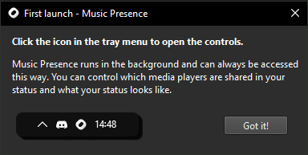
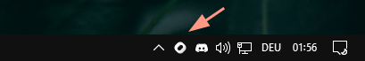
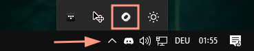

# How to install and use Music Presence

To install Music Presence, pick the right download for your platform:

<!-- DL_BUTTONS_BEGIN -->
[](https://github.com/ungive/discord-music-presence/releases/download/v2.3.4/musicpresence-2.3.4-windows-x64-installer.exe)
[](https://github.com/ungive/discord-music-presence/releases/download/v2.3.4/musicpresence-2.3.4-windows-x64.zip)
[](https://github.com/ungive/discord-music-presence/releases/download/v2.3.4/musicpresence-2.3.4-mac-arm64.dmg)
[](https://github.com/ungive/discord-music-presence/releases/download/v2.3.4/musicpresence-2.3.4-mac-x86_64.dmg)
[](https://github.com/ungive/discord-music-presence/releases/download/v2.3.4/musicpresence-2.3.4-linux-x86_64.AppImage)
[](https://github.com/ungive/discord-music-presence/releases/download/v2.3.4/musicpresence-2.3.4-linux-x86_64.deb)
[](https://github.com/ungive/discord-music-presence/releases/download/v2.3.4/musicpresence-2.3.4-linux-x86_64.rpm)
[](https://github.com/ungive/discord-music-presence/releases/download/v2.3.4/musicpresence-2.3.4-linux-x86_64.tar.gz)
<!-- DL_BUTTONS_END -->

> *Don't know what download to choose?*
> *Click [**here**](#which-download-should-i-choose)*
> *or scroll to the bottom of the page.*

On macOS, you can also install Music Presence via
[Homebrew](https://formulae.brew.sh/cask/music-presence#default)
and get automatic updates:

```sh
$ brew install --cask music-presence
```

Continue reading for detailed instructions on how to install your download.

After installing the app for the first time,
you should see the following popup window appear.
That's when you know you did everything right
and you're ready to use Music Presence!



## Windows

If you downloaded the `exe` file,
simply double-click it and follow the installer's instructions.
At the end you should be given the option to launch Music Presence.
You will also get a start menu entry and for convenience,
Music Presence will launch whenever you log into your computer.

If you picked the `zip` file download,
you have to right-click and extract it,
then open the extracted folder, double-click `Music Presence.exe`
and you are good to go!

## Mac

To install the app, mount the downloaded DMG file,
drag the app into your applications folder and double-click it,
it should open right-away after confirming that you want to open
an app that was downloaded from the internet.

To start Music Presence whenever you log in to your computer,
select it as a login item in your system settings.

Since version 2.3.1, Music Presence for Mac
is signed and notarized with my Apple Developer ID.

## After installation

After you installed and started Music Presence,
you should see an icon in the tray menu of your device:



On Windows it might be hidden under the little arrow
when you start it for the first time:



On Mac it should appear in your system tray as well:


Clicking on the icon will open a small menu.
Play some media with your favourite media player
and see if it appears in that menu.
Most media players should work right out of the box.

If your media player is not detected,
please read the troubleshooting guide [**here**](./troubleshooting.md)
or click on "Help" > "Something is not working" in the Music Presence menu.

## Which download should I choose?

Are you on Windows? Simply pick the `exe` download,
this should be the easiest to install!

On Mac you need to check if you're using an Intel or an Apple Silicon Mac first.
Click the Apple logo in the top left of your screen,
then click "About This Mac".

- If it shows "M1", "M2", "M3" or similar under the Chip category,
  then you're on **Apple Silicon**
  and you need to pick the Apple Silicon download from above
- If it shows "Intel" under the Processor category,
  you're using an **Intel** CPU and you need to pick the
  "Intel x86_64" download from above

## Still need help?

Join our Discord community:
[**discord.gg/musicpresence**](https://discord.gg/musicpresence)

Or open an issue here:
[**github.com/ungive/discord-music-presence/issues**](https://github.com/ungive/discord-music-presence/issues)

---

## If you're willing to donate to the project

You can make a small monthly donation to help with
making the installation experience more straightforward and less involved,
especially for Mac users.
Your donation helps with:

- Maintaining the costs for my Apple Developer account (99 USD a year)
  to sign and notarize macOS builds
  and maintain animated album covers for Apple Music
  ([#23](https://github.com/ungive/discord-music-presence/issues/123))
- At some point get a Windows signing certificate
  (prices vary, but certificates cost multiple hundred dollars a year).
  The need for this is not as high as signed builds for macOS though,
  since macOS makes it especially hard to install unsigned apps,
  even more so since macOS Sequoia

Check the links [**here**](https://donate.musicpresence.app)
for all available donation options.
Thank you, if you do decide to make a donation!
