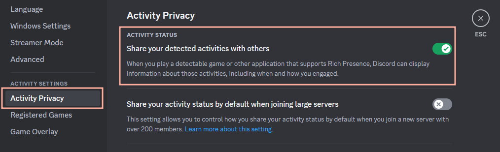
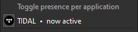

# Troubleshooting

Follow this guide step-by-step to troubleshoot your issue.

* [Check your Discord settings first](#check-your-discord-settings-first)
* [Media players that don't work out of the box](#media-players-that-dont-work-out-of-the-box)
* [Web versions of streaming services are not supported yet](#web-versions-of-streaming-services-are-not-supported-yet)
* [Reinstall your media player](#reinstall-your-media-player)
* [The player is detected, but still no status](#the-player-is-detected-but-still-no-status)
* [Are you running Discord as administrator?](#are-you-running-discord-as-administrator)
* [Other edge cases](#other-edge-cases)
* [If your media player is still not detected](#if-your-media-player-is-still-not-detected)
* [Your media player does not integrate with your operating system](#your-media-player-does-not-integrate-with-your-operating-system)
* [Reporting a different problem](#reporting-a-different-problem)
* [Edge cases](#edge-cases)
    * [Custom Windows ISO installs may interfere](#custom-windows-iso-installs-may-interfere)
    * [Windows tweaks may interfere](#windows-tweaks-may-interfere)
    * [Windows 10 or later is needed](#windows-10-or-later-is-needed)
    * [explorer7 is not supported](#explorer7-is-not-supported)

# Common Issues 

## Check your Discord settings first

Make sure "Share your detected activities with others"
is enabled in your Discord settings:

If that does not help, read on.

## Media players that don't work out of the box

These players require a plugin or helper program:

- **AIMP**
- **iTunes**
- **mpv**
- **MusicBee**
- **VLC**

If you have issues with any of these players,
please refer to the "Additional notes" in
[**this document**](https://github.com/ungive/discord-music-presence/blob/master/documentation/supported-media-players.md)
for instructions on which external plugins or helper programs are required
to get them to be detected by Music Presence.

Otherwise, continue reading the next section.

## Web versions of streaming services are not supported yet

For now, please use the desktop version of your streaming service.

If you're not using a web player, move on to the next section.

Music Presence won't detect media from websites yet,
if you are on Mac or Windows.
That is because these operating systems do not report
what website the media is being played on,
which makes it impossible to determine the source.
Support for browsers will arrive
[in a future update](https://github.com/ungive/discord-music-presence/issues/5).

## Reinstall your media player

if you are having issues with your media player being detected,
you could try to reinstall it. You may need to remove
all traces of your media player in `%APPDATA%` to
reinstall properly.

If you are using Spotify on Windows
and your player is not detected, this
should help. Remove all traces of 
Spotify in `%APPDATA%\Spotify` and 
try again.

If that did not help, continue reading to the next section.

## The player is detected, but still no status

Can you see the media player detected in the tray menu?

And does the tray icon have this little triangle in the bottom right
while you are playing music?

If not, move on to the next section.

Otherwise try reinstalling Discord.
This happens rarely, but sometimes
Discord just refuses to show any presence until you reinstall it completely.

Does it still not work? Try logging in and out of your Discord account.

## Are you running Discord as administrator?

If not, continue with the next section.

If you are running Discord as administrator,
running it without these elevated privileges should fix your issue.

If you insist on running Discord as administrator though,
you won't get around running Music Presence as administrator as well,
as otherwise it won't be able to communicate with the Discord client.
This not recommended though, as running third-party software
as administrator is a choice you should think at least twice about.
I do not recommend this!

## Other edge cases

Please also check the [**Edge cases**](#edge-cases) section below,
if you are running an unusual system configuration,
e.g. a very outdated or heavily modified operating system.
This especially applies if you modified your Windows installation.

Otherwise read on.

## If your media player is still not detected

First make sure you played some media with your media player
while Music Presence is running.

After that, navigate to the **Help** menu and click on

- **Submit detected media players**

This will open a new GitHub issue with information about all media players
that have been detected since you started Music Presence.
Submit the issue and I will come back to you as soon as I can.

You will need a GitHub account to submit the issue.
If you don't want to register one,
you can alternatively copy the link in the address bar,
join the [Discord server](https://discord-invite.musicpresence.app)
and then paste the copied link in the `#troubleshooting` channel.

If the GitHub issue is empty,
then your media player might not report anything to the operating system.
In that case you may still submit the GitHub issue,
but you mave to make a feature request with your media player.
Read on for more information.

## Your media player does not integrate with your operating system

Do you not see any media controls for the song you are playing
with your media player, like they are visible in the following screenshots?
https://imgur.com/a/YDQegwW

Then it's pretty certain that your media player does not report information
about the media it is playing to your operating system.
In that case you should make a **feature request with your media player**,
to suggest that they integrate with your operating system.

You can **use this template** for that,
it contains all the important information
the developers of the media player need to get started:
[support-template.md](./support-template.md)

## Reporting a different problem

If you have a different issue, please open a
[GitHub issue](https://github.com/ungive/discord-music-presence/issues/new/choose)
or join the [Discord server](https://discord-invite.musicpresence.app).

## Edge cases

#### Custom Windows ISO installs may interfere

For users on Windows, some custom ISOs may interfere with Music Presence by making irreversible and other changes to the OS that disable or completely break SMTC. Support on these versions may not receive support officially as they make changes that interfere with SMTC. This mainly affects optimization scripts that remove core Windows elements such as Atlas OS, ReviOS, Ghost Spectre, and some other projects that modify Windows components. While some operating systems mods such as Tiny11 may have SMTC, they may not be officially supported.

Instructions on how to restore SMTC will vary between mod to mod. For some mods, you may not be able to restore SMTC, and will need to reinstall an official Windows version. Some mods, such as Reunion7, will not be affected. If you are unsure if your mod supports SMTC, try pausing your music with your keyboard, if your keyboard has media keys.

#### Windows tweaks may interfere

If you have used an optimization software recently, you may want to consider reverting some of the tweaks you applied. Some optimization software, such as Hellzerg's Optimizer and WinUtils may make changes that disables SMTC. If you recently made a change with one of these kinds of softwares, try reverting the changes you made first.
Some software that only make cosmetic and other minor changes to the system, such as Winaero Tweaker and TronScript, are unaffected.

#### Windows 10 or later is needed

You must be using a windows version that is at least Windows 10 or above. Any version of Windows 10 or 11 should be perfectly fine, as long as it is not corrupted or heavily modified. If you are using a version under Windows 10 Build 10240 (2015), including a version of Windows with an extended kernel, you will have to update to use Music Presence.

#### explorer7 is not supported

If you are using explorer7, you will have to switch back to the Windows 10 explorer to use Music Presence. Because of how explorer7 works, it uses the official Windows 7 shell, which disables features such as Microsoft Store apps and SMTC, which Music Presence relies on. Please revert the shell mode to Windows 10 before continuing.

---

If none of these edge cases apply to you,
feel free to open a
[GitHub issue](https://github.com/ungive/discord-music-presence/issues/new/choose)
or join the [Discord server](https://discord-invite.musicpresence.app).
